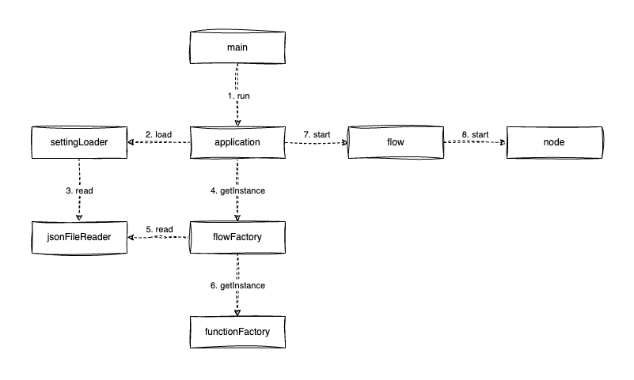
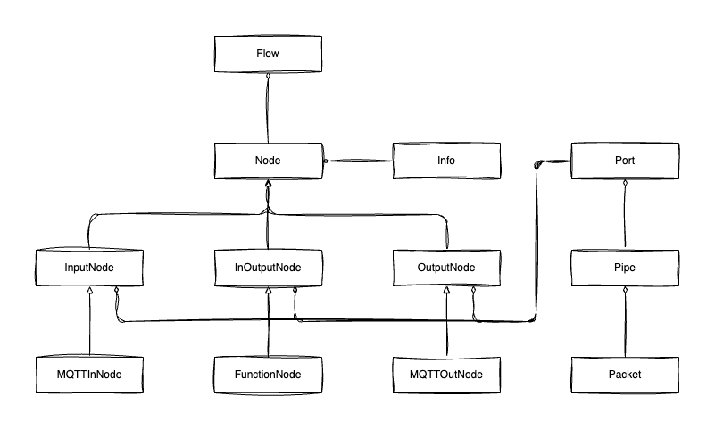

# 📡 IoT Gateway
NHN Academy IoT Gateway 팀 프로젝트 저장소

팀 구성원: **남지민, 변상우, 배범익, 이정용, 이주현**

# ℹ️ About
LoRa 디바이스를 관리하는 ChirpStack 서버와 연동하여, 데이터를 수집하는 Gateway를 만드는 프로젝트입니다.

# ✴️ Feature
- 커맨드라인으로 옵션을 설정할 수 있습니다.
  ```sh
  java -jar iot-gateway.jar -an 'application/#' -s 'temperature,humidity' -c 'settings.json'
  ```
  - `-an`: 수신할 메세지의 application name을 지정합니다.
  - `-s`: 처리할 센서 타입을 지정합니다.
    - `,`로 구분하여 여러 센서 타입을 지정할 수 있습니다.
  - `-c`: 불러올 설정 파일을 지정합니다.
    - 커맨드라인 옵션과 설정 파일이 함께 주어질 경우 커맨드라인 옵션이 우선됩니다.
- MQTT로 데이터를 받을 수 있습니다.
  - **application name**에 해당하는 메세지만 수신합니다.
  - **JSON 포맷**의 데이터를 처리합니다.
- 데이터를 가공할 수 있습니다.
  - 설정한 센서 타입의 데이터만 처리합니다.
  - 데이터에 **지사**, **위치**, **장치식별번호**, **시간**, **측정값**을 포함합니다.
- MQTT로 데이터를 전송할 수 있습니다.
  - 가공한 데이터를 전송합니다.
  - 게이트웨이의 **상태**를 알릴 수 있습니다.
    - 일정시간마다 게이트웨이의 상태 정보를 알립니다.
    - 게이트웨이가 시작되거나 종료될 때 알립니다.
- 각 기능별 **상태 정보**를 저장할 수 있습니다.
  - 받은 패킷 수, 보낸 패킷 수, 비정상 패킷 수를 기록합니다.
- 설정을 영속성으로 관리할 수 있습니다.
  - 설정 파일 포맷은 **JSON**입니다.
  - application name과 센서 타입을 기술할 수 있습니다.
  - 입력, 출력, 동작 상태 등 각각의 기능별로 구분하여 설정을 기술할 수 있습니다.

# 📐 Diagram

